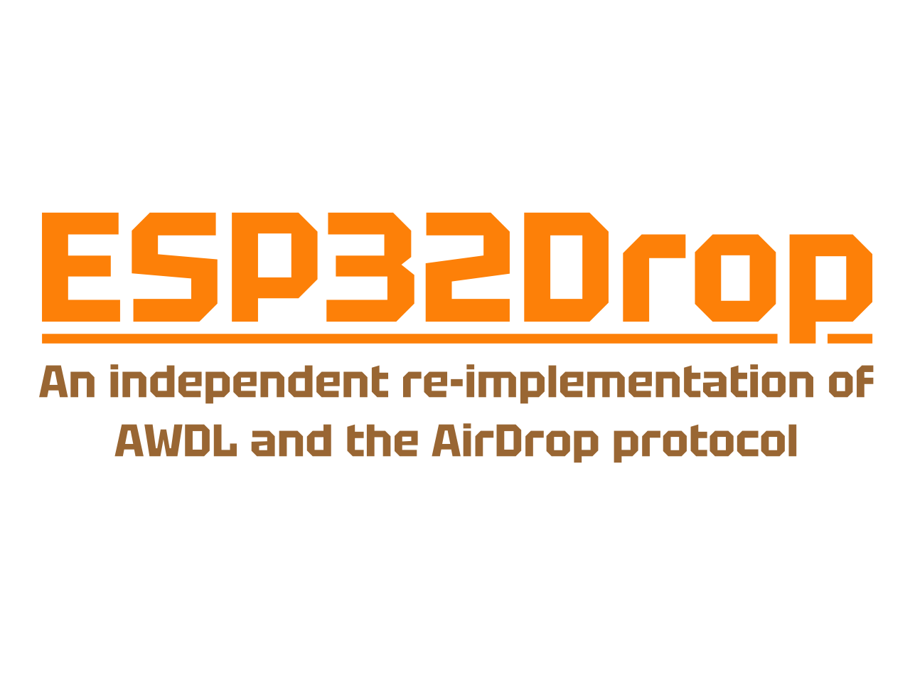

<p align="center">
  
</p>

# ESP32Drop

**English** | [日本語](#日本語)

A library and example sketches that do AirDrop on an ESP32-S3. Open the share sheet on a
Mac or iPhone, pick the device, send a photo, and it appears on the screen. The device can
also send files the other way, to a Mac or an iPhone. The two ends connect directly, so no
pairing and no router are involved.

This is an independent re-implementation of Apple Wireless Direct Link and the AirDrop
protocol, written from observed traffic. **Not affiliated with, authorised by, or endorsed
by Apple Inc.** AirDrop is a trademark of Apple Inc.; it is used here only to say what this
software is compatible with.

```cpp
#include <ESP32AWDL.h>
#include <ESP32Drop.h>

static bool on_file(void *, const struct AdFile *f) {
  Serial.printf("got %s, %lu bytes\n", f->name, (unsigned long)f->len);
  return true;                       // f->data is borrowed; copy what you keep
}

void setup() {
  Serial.begin(115200);
  awdl_begin();                      // bring up the link first
  ad_on_file(on_file, nullptr);
  ad_begin("ESP32 Receiver", 0);     // the name the share sheet shows; 0 = default 6 MiB cap
}

void loop() { ad_poll(); delay(10); }
```

`examples/PrintReceivedFiles` is that sketch, complete. `examples/ShowReceivedImage` puts
the photo on the display. `examples/GreetingCard` goes the other way: it sends a greeting
card image to a nearby device.

## Installing

The library is the `ESP32Drop/` folder inside this repository, the one that holds
`library.properties`. Copy or symlink that folder into your Arduino `libraries/` directory,
or pass it to `arduino-cli compile --library path/to/ESP32Drop/ESP32Drop`. It is not in the
Library Manager index.

It was written and verified on an M5Stack StopWatch with the `m5stack:esp32` board core,
version 3.3.8, and the board options `PSRAM=opi` and `PartitionScheme=huge_app`
(`tools/common.sh` has the exact FQBN). Other ESP32-S3 boards and other core versions have
not been tried. `ShowReceivedImage` and `GreetingCard` also need the M5Unified library;
`PrintReceivedFiles` needs nothing else.

A sending sketch defines `ESP32DROP_SENDER`, and the define has to be in a `build_opt.h`
file beside the sketch, not in the `.ino`: a define in the sketch reaches the sketch alone,
while `build_opt.h` is passed to every compilation, so the library sees it too.
`examples/GreetingCard/build_opt.h` is that one line.

## What you need

- **An ESP32-S3 with PSRAM.** A transfer is decoded in PSRAM; a part without it cannot
  receive. Written, tested and the examples verified on an M5Stack StopWatch.
- **The radio, exclusively.** AWDL normally hops between 2.4 GHz and 5 GHz. The ESP32 has
  2.4 GHz Wi-Fi only, so this implementation stays on 2.4 GHz channel 6 and runs in step
  with the AWDL mesh's availability window. Keeping that synchronisation strict is why the
  interface cannot be shared with `WiFi.begin()`. Do not call both.
- Nothing else. No pairing, no account, no access point. AWDL is a direct link, so any
  device can send to it with no special setup.

Heavy work in `loop()` is fine. Transmit timing is handled by a dedicated high-priority
task.

## What it can and cannot do

**Can**

- Receive files
  - Listens as an AirDrop "Everyone" target, then receives and decodes the files.
  - Several files in one transfer work; the callback fires once per file.
- Send files
  - Sends one file of any type to a device that is listening as an AirDrop "Everyone"
    target. You pass a MIME type or an Apple UTI, or leave it out and JPEG, PNG, GIF,
    HEIC, PDF and ZIP are read from the leading bytes. Anything that cannot be settled
    is refused rather than guessed.
  - PNG and JPEG have been sent and accepted: files under 128 KiB (the `GreetingCard`
    example) to a Mac and to an iPhone, larger files to a Mac only. Every other type is
    sent exactly as declared, and whether a given peer takes it is not something this
    library knows.
- Announce any device name
  - The name is UTF-8, so it can be anything. Emoji are verified working.

**Cannot**

- "Contacts Only", in either direction
  - That needs Apple's own signed identity information, which cannot be implemented from
    openly available information.
- Receive and send from the same build
  - The two can coexist in source, but the ESP32 does not have the memory to have both
    enabled at once.
  - A receiving build and a sending build are separate, and each compiles in only the
    modules it needs.
  - Define `ESP32DROP_SENDER` in `build_opt.h` to get the sending build (see Installing).
- Send quickly and dependably
  - There can be a delay between the device starting a send and the file arriving. This is
    a memory constraint too.
  - Sending over AirDrop means first waking the receiving side's listener, and that takes
    BLE rather than Wi-Fi.
  - BLE only has to put out a very simple packet, an advertisement, but the ESP32's BLE
    library costs about 26 KB of internal RAM just for that, which leaves nothing for the
    rest of the work to run alongside.
  - So the memory constraint makes the two radios take turns: BLE on with Wi-Fi fully
    stopped to advertise, then BLE off and Wi-Fi back up again.
  - Bringing Wi-Fi back also costs the time AWDL needs to resynchronise. Advertisements
    therefore go out only at sparse intervals, and the Wi-Fi watch has gaps in it. Neither
    is avoidable in principle.
- Coexist with ordinary Wi-Fi
  - An iPhone or a Mac runs ordinary Wi-Fi and AWDL/AirDrop at the same time. This
    implementation has no such arbitration.

## Limits

**Receive ceiling.** `ad_begin(name, max_receive)` bounds the decoded archive this device
accepts, and with it the PSRAM the library holds during a transfer. Pass 0 for the
library's own default of 6 MiB; PSRAM only lowers that ceiling, never raises it, and
`ad_stats_read()` reports the one actually in force. A transfer over the limit is refused
with HTTP 413, so the sender reports a failure instead of appearing to succeed. Measured: a
3.9 MB photo arrives as a 3,860,992-byte archive and is decoded while it is still arriving,
so the compressed body is never held alongside the decoded one. An 8 MB part has room for
about 7.1 MB of decoded archive, so pass that figure yourself if you want more than 6 MiB.

**Send ceiling.** One file per send: `TotalBytes` was measured equal to `FileSize` for one
file and its value for several is unknown. PSRAM must hold the archive and its framing,
about twice the file, for the length of the transfer; `ad_send()` takes both blocks before
`/Discover` and returns `AD_SEND_E_TOO_BIG` if they will not fit, so nobody is shown a
dialog for a file that cannot be built. Names are at most 120 bytes of UTF-8 and may not
contain `/`.

The body goes out as a run of 128 KiB-grain DvZip records, which is how a real macOS sender
frames one. That grain is not cosmetic: a single record larger than it reaches the receiver
whole and is then rejected at 100% with a connection reset and no reply, because the
receiving DvZip adapter assumes the grain. Files below one grain were always a single record
and always worked, which is why the fault only appeared once a photo was sent. Photos of
270-314 KB complete to a Mac; larger sends, and multi-record sends to an iPhone, are
untested.

**Internal RAM is the scarce resource, not PSRAM.** mbedTLS here is built with
`CONFIG_MBEDTLS_INTERNAL_MEM_ALLOC` and cannot fall back to PSRAM, and a session wants two
contiguous buffers of about 16.6 KB, so what runs out is **the largest free block**, not
the total. Measured free internal heap: about 40.5 KB idle, with a low watermark of **20.9 KB
during a transfer**, and a largest free block of 31.7 KB. Adding statics of your own is enough to
stop TLS from starting, and the symptom is not an error message but **simply never being
discovered**. If the device stops appearing in the share sheet after you add a buffer, this
is why. Put big buffers in PSRAM.

**A permanent limitation.** The ESP32 Wi-Fi driver will not transmit the frame shape real
AWDL uses for data (QoS Data with `(fc1 & 3) == 0`); `esp_wifi_80211_tx` refuses it. This
implementation works within what the driver will send.

## Diagnostics

The library never writes to `Serial`. Its lines are produced on the TLS task, so it stages
them and you decide where they go:

```cpp
char line[200];
while (ad_diag_read_line(line, sizeof(line))) Serial.print(line);
```

`ad_diag_read_line()` is the receiver's reader. In a sending build the lines are staged by
the AWDL layer instead, so use `awdl_diag_read_line()`. Using the wrong one fails at link
time.

`ad_stats_read()` fills a struct with counters and states — how many transfers were
accepted, whether one is arriving now, how many bytes so far, the ceiling in force, and the
last error as text.

The AWDL dump ring records frame headers only. Capturing packet payloads costs internal
RAM, the resource above, so it is opt-in: build with `-DAWDL_DIAG_PAYLOAD_MAX=1500`.

## Tests

Every byte the parsers see arrives from somebody else's device, so they live in
dependency-free C headers under `src/*/core/` and are compiled **unchanged** into host
tests:

```
./tools/lint.sh              warnings the normal build suppresses, as errors
./tools/check-library.sh     the layering rules, both directions
./tools/build-examples.sh    every example still compiles
for t in tools/test-*.sh; do "$t"; done
```

Host tests build with `-fsanitize=address,undefined`. Several fixtures are real captured
Apple traffic; `testdata/dvzip_census.inc` is the shape of a real 2.35 MB transfer with the
payloads removed. The fixtures carry no device names and no Apple
identifiers: the values a capture picks up — device names, and the session and
companion-link UUIDs — were replaced with same-length placeholders, so the fixtures keep
their original structure and their original size.

## Layout

```
ESP32Drop/src/ESP32AWDL.h       the link layer's public header
ESP32Drop/src/ESP32Drop.h       the AirDrop layer's public header, receiving and sending
ESP32Drop/src/awdl/core/        link-layer logic, dependency-free, host-tested
ESP32Drop/src/awdl/port/        the ESP32 radio, netif and timing
ESP32Drop/src/airdrop/core/     HTTP, DvZip, cpio, bplist, DNS-SD, UTI — host-tested
ESP32Drop/src/airdrop/port/     TLS termination and the ESP32 network path
ESP32Drop/src/airdrop/ad_send.* the send path
ESP32Drop/src/airdrop/ad_cycle.* the BLE and AWDL alternation a send needs
ESP32Drop/src/ble/              a minimal BLE advertiser, controller only
tools/                          build, lint, layering and host-test scripts
```

Comments in the source quote sizes, timings and counts. Those were measured on hardware while
the library was written; where a number was not measured, the comment says so.

## Licence

Zero-Clause BSD. Do anything; no attribution required. See `LICENSE`.

No warranty of any kind, including non-infringement. AWDL and AirDrop are Apple protocols
and may be covered by patents or other rights held by third parties; nothing in this
licence grants any rights in them, and none could.

---

# 日本語

[English](#esp32drop) | **日本語**

ESP32-S3でAirDropを実現するライブラリとサンプル実装です。MacやiPhoneから共有シートを開いてデバイスを選び、
写真を送るだけで画面に表示されます。逆に、MacやiPhoneにデバイスの側からファイルを送りつけることもできます。
端末同士が直接接続し、ペアリングやルータなどは一切必要ありません。

これはApple Wireless Direct LinkとAirDropプロトコルの、観測したトラフィックから書き起こした
独立再実装です。**Apple Inc. とは無関係で、許諾も承認も受けていません。** AirDropはApple Inc.の商標ですが、
ここでは「何と互換なのか」を述べるためだけに使っています。

```cpp
#include <ESP32AWDL.h>
#include <ESP32Drop.h>

static bool on_file(void *, const struct AdFile *f) {
  Serial.printf("got %s, %lu bytes\n", f->name, (unsigned long)f->len);
  return true;                       // f->data is borrowed; copy what you keep
}

void setup() {
  Serial.begin(115200);
  awdl_begin();                      // bring up the link first
  ad_on_file(on_file, nullptr);
  ad_begin("ESP32 Receiver", 0);     // the name the share sheet shows; 0 = default 6 MiB cap
}

void loop() { ad_poll(); delay(10); }
```

`examples/PrintReceivedFiles` がこのスケッチの完全版です。`examples/ShowReceivedImage` は
受け取った写真をディスプレイに表示します。`examples/GreetingCard` は逆方向 ── 近接端末にグリーティングカード画像を送信します。

## インストール

ライブラリ本体はこのリポジトリ内の `ESP32Drop/` フォルダ（`library.properties` があるほう）です。
このフォルダを Arduino の `libraries/` にコピーかシンボリックリンクするか、
`arduino-cli compile --library path/to/ESP32Drop/ESP32Drop` で渡してください。Library Manager には登録していません。

実装と検証は M5Stack StopWatch、ボードコア `m5stack:esp32` 3.3.8、ボードオプション `PSRAM=opi` と
`PartitionScheme=huge_app` で行いました（正確な FQBN は `tools/common.sh` にあります）。他の ESP32-S3 ボードや
他のコアバージョンは試していません。`ShowReceivedImage` と `GreetingCard` は M5Unified も必要です。
`PrintReceivedFiles` は他に何も要りません。

送信用スケッチでは `ESP32DROP_SENDER` を定義しますが、これは `.ino` ではなくスケッチの隣の `build_opt.h` に
書く必要があります。`.ino` 内の `#define` はスケッチにしか届かず、`build_opt.h` はすべてのコンパイルに渡されるので
ライブラリにも届きます。`examples/GreetingCard/build_opt.h` がその 1 行です。

## 必要なもの

- **PSRAM 付きの ESP32-S3。** 転送は PSRAM 上でデコードします。PSRAM のないモデルでは、
  受信できません。実装とテストは M5Stack StopWatch で行いました。サンプルコードはM5Stack Stopwatchで確認しています。
- **無線を占有できること。** AWDLは本来2.4GHzと5GHzの間をホップしますが、ESP32は2.4GHz WiFiしか
  使用できないため、2.4GHz Ch6を使用しています。AWDLメッシュネットワークの無線ウインドウに同期して動作します。
  厳密に同期動作を行うため、`WiFi.begin()` とインタフェースを共有することはできません。両方を呼ばないでください。
- それ以外は何も要りません。ペアリングもアカウントもアクセスポイントも不要です。AWDL は
  ダイレクトリンクであり、特別な操作なく任意の端末から送信することができます。

`loop()` で重い処理をしても問題ありません。送信のタイミングは高優先度の専用タスクが処理しています。

## できること・できないこと

**できること**
- ファイル受信
  - AirDropのeveryone（すべての人）設定での待ち受けを行い、ファイルを受信・デコードすることが可能です。
  - 複数のファイル転送も可能です。コールバックがファイルごとに発火します。
- ファイル送信
  - AirDropのeveryone（すべての人）設定での待ち受けをしている端末に対し、任意の形式のファイルを
    1 つ送信することができます。形式は MIME タイプか Apple UTI を渡すか、省略すれば
    JPEG / PNG / GIF / HEIC / PDF / ZIP は先頭バイトから判定します。判定できないものは
    推測せず拒否します。
  - 実機で確認できているのは PNG と JPEG で、128 KiB 未満のファイル（`GreetingCard` example）は
    Mac 宛・iPhone 宛とも、それより大きいファイルは Mac 宛のみです。それ以外の形式は宣言どおりに
    送りますが、相手が受け入れるかどうかはライブラリには分かりません。
- 自由な端末名を名乗らせる
  - UTF-8で自由な端末名を名乗らせることができます。絵文字も動作確認済

**できないこと**
- 「連絡先のみ」の送受信
  - 「連絡先のみ」の送受信を実現するためには、Apple独自の署名情報が必要で、オープンな情報からでは実装することができません。
- ファイル受信とファイル送信の同時利用
  - コード上は共存可能ですが、同時に有効にするにはESP32のメモリが足りません。
  - 受信用のビルドと、送信用のビルドは変える必要があります。それぞれ最小限のモジュールのみ組み込むようになっています。
  - 送信用のビルドを作るときには `build_opt.h` で `ESP32DROP_SENDER` を定義してください（「インストール」参照）。
- 安定した、素早い送信
  - デバイス側AirDrop送信開始から着信までに時間がかかることがあります。これもメモリ不足からの制約となります。
  - AirDropでファイルを送信するためには、先だって受信側の受信体制を起動させる必要があります。そして、そのためにはWiFiではなくBLEを使用します。
  - BLEではごく簡単なパケット（アドバタイズパケット）を送信するだけなのですが、ESP32でのBLEライブラリを使用すると、それだけでも内蔵RAMを26KBほど使用してしまい、他の処理が併存できないことがわかっています。
  - そのため、本実装ではBLEアドバタイズのときはBLE有効・WiFiを完全に停止し、BLEを送信したあとBLEを無効・WiFiを起動する、と、メモリ制約のために排他で動作させています。
  - WiFi起動後AWDLの同期にかかる時間もあるため、BLEのアドバタイズがどうしても疎な間隔になること、WiFiの監視時間に穴ができることが原理上避けられません。
- 通常WiFiとの共存
  - iPhone/Macでは通常のWiFiとAWDL/AirDropを共存させることができますが、本実装ではそういった制御はできません。

## 限界

**受信の上限。** `ad_begin(name, max_receive)` は、このデバイスが受け入れるデコード後の
アーカイブサイズ ── ひいては転送中にライブラリが確保する PSRAM ── を制限します。
ライブラリ既定の 6 MiB でよければ 0 を渡してください。PSRAM はこの上限を下げることは
あっても上げることはなく、実際に効いている値は `ad_stats_read()` が返します。上限を超える
転送は HTTP 413 で拒否するので、送信側は成功したように見えるのではなく失敗を報告します。
実測: 3.9 MB の写真は 3,860,992 バイトのアーカイブとして到着し、到着しながらデコードされる
ので、圧縮された本体がデコード後のものと同時に保持されることはありません。8 MB 品なら
デコード後 約 7.1 MB まで置けるので、6 MiB より大きくしたいときは自分でその値を渡して
ください。

**送信の上限。** 1 回の送信につき 1 ファイルです（`TotalBytes` が `FileSize` と一致するのは
1 ファイルでの実測で、複数のときの値は不明）。転送中は PSRAM がアーカイブとその framing、
つまりファイルの約 2 倍を保持します。`ad_send()` は `/Discover` の前にこの 2 ブロックを確保し、
入らなければ `AD_SEND_E_TOO_BIG` を返します ── 作れないファイルのために相手にダイアログを
出させないためです。ファイル名は UTF-8 で 120 バイトまで、`/` は使えません。

本体は 128 KiB 粒度の DvZip レコードの連なりとして送出されます。これは実際の macOS 送信側と
同じ形で、粒度は飾りではありません ── 粒度を超える単一レコードは受信側に丸ごと届いたうえで
100% の時点で接続リセットされ、応答なく拒否されます。受信側の DvZip アダプタが粒度を前提に
しているためです。1 粒度未満のファイルは常に単一レコードで、常に成功していました。だから
写真を送るまでこの不具合は現れませんでした。270〜314 KB の写真は Mac 宛に完了します。
それより大きい送信と、複数レコードになるサイズの iPhone 宛送信は未検証です。

**希少な資源は PSRAM ではなく内部 RAM です。** ここでの mbedTLS は
`CONFIG_MBEDTLS_INTERNAL_MEM_ALLOC` でビルドされており PSRAM にフォールバックできません。
そしてセッションは約 16.6 KB の連続バッファを 2 つ要求します ── つまり枯渇するのは合計値
ではなく**最大の空きブロック**です。実測した空き内部ヒープ: アイドル時 約 40.5 KB、
**転送中の最低水位 20.9 KB**、最大空きブロック 31.7 KB。自前の static を足すだけで TLS が
起動できなくなることがあり、その症状はエラーメッセージではなく、**単に発見されなくなる**
ことです。バッファを足したあとデバイスが共有シートに出てこなくなったなら、理由はこれです。
大きなバッファは PSRAM に置いてください。

**恒久的な制限。** ESP32 の Wi-Fi ドライバは、実際の AWDL がデータに使うフレーム形状
(`(fc1 & 3) == 0` の QoS Data) を送信しません。`esp_wifi_80211_tx` が拒否します。この実装は
ドライバが送ってくれる範囲内で動いています。

## 診断

ライブラリは `Serial` に一切書きません。ログ行は TLS タスク上で生成されるので、ライブラリは
それをステージングし、どこへ出すかはあなたが決めます:

```cpp
char line[200];
while (ad_diag_read_line(line, sizeof(line))) Serial.print(line);
```

`ad_diag_read_line()` は受信側のリーダです。送信ビルドでは AWDL 層がログ行をステージング
するので、`awdl_diag_read_line()` を使ってください。取り違えるとリンクエラーになります。

`ad_stats_read()` は、カウンタと状態を構造体に埋めます ── 受け入れた転送の数、いま到着中か
どうか、これまでのバイト数、効いている上限、そして直近のエラーをテキストで。

AWDL のダンプリングはフレームヘッダだけを記録します。ペイロードのキャプチャは上に書いた
希少資源である内部 RAM を消費するので、オプトインです: `-DAWDL_DIAG_PAYLOAD_MAX=1500` を
付けてビルドしてください。

## テスト

パーサへの入力はすべて他人の端末から届くものです。そこで依存のない C ヘッダとして
`src/*/core/` に置き、**そのまま**ホストテストにコンパイルしています:

```
./tools/lint.sh              通常ビルドが抑制している警告を、エラーとして
./tools/check-library.sh     レイヤリング規則を、双方向に
./tools/build-examples.sh    すべての example がまだコンパイルできること
for t in tools/test-*.sh; do "$t"; done
```

ホストテストは `-fsanitize=address,undefined` でビルドします。いくつかのフィクスチャは実際に
キャプチャした Apple のトラフィックで、`testdata/dvzip_census.inc` は実在の 2.35 MB 転送から
ペイロードを抜いた「形」です。フィクスチャに端末名も Apple の識別子も含まれていません:
キャプチャが拾ってしまう値 ── 共有シートがマシンを呼ぶ名前、セッションおよび
companion-link の UUID ── は同じ長さのプレースホルダに置換してあり、どのパーサも以前と
同じ構造を見て、ファイルサイズもバイト単位で同一です。

## 構成

```
ESP32Drop/src/ESP32AWDL.h       リンク層の公開ヘッダ
ESP32Drop/src/ESP32Drop.h       AirDrop 層の公開ヘッダ。受信・送信とも
ESP32Drop/src/awdl/core/        リンク層のロジック。依存なし、ホストテスト済み
ESP32Drop/src/awdl/port/        ESP32 の無線・netif・タイミング
ESP32Drop/src/airdrop/core/     HTTP, DvZip, cpio, bplist, DNS-SD, UTI ── ホストテスト済み
ESP32Drop/src/airdrop/port/     TLS 終端と ESP32 のネットワークパス
ESP32Drop/src/airdrop/ad_send.* 送信パス
ESP32Drop/src/airdrop/ad_cycle.* 送信に必要な BLE と AWDL の切り替え
ESP32Drop/src/ble/              最小構成の BLE アドバタイザ（コントローラのみ）
tools/                          ビルド・lint・レイヤリング・ホストテストのスクリプト
```

ソース中のコメントにはサイズ・時間・回数の数値が多く出てきます。これらはライブラリを書きながら実機で
測ったもので、測っていない数値についてはコメントにそう書いてあります。

## ライセンス

Zero-Clause BSD. Do anything; no attribution required. See `LICENSE`.

No warranty of any kind, including non-infringement. AWDL and AirDrop are Apple protocols
and may be covered by patents or other rights held by third parties; nothing in this
licence grants any rights in them, and none could.
